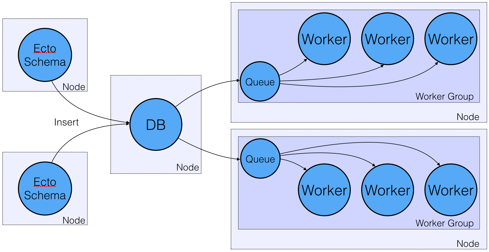

# Ecto Poll Queue


The Ecto Poll Queue turns your Ecto schema into a queue, for jobs that need to be run every time you insert a new row into your database. For example, if a user uploads a song file, and you want to transcode it into a number of different formats, or if a user uploads a photo and you want to run your object classifier against it.

## Advantages

1. State unification, your database is the queue itself. This queue removes the risk that your database and work queue become out of sync. For instance, if you save a model to your database, and before your process can enqueue its job, it suffers a failure that prevents it from contacting the queue, be it a crash, a hardware failure or a network segmentation. If Ecto inserted your row, the job will run.

2. You don't need to run an entirely separate queue deployable and manage its interconnection with distributed Erlang. In a typical scenario, you may have application nodes serving user traffic, a queue node, and background wokers. The Ecto queue eliminates the need for the queue node, and the use of distributed Erlang (for work queue purposes) entirely.

3. Honeydew automatically "enqueues" jobs for you, to reflect the state of your database, you don't enqueue jobs in your application code. 
You don't need to use `enqueue/2` and `yield/2`, in fact, they're unsupported.

With this queue type, your database is the sole point of coordination, so any availability and replication guarantees are now shared by Honeydew. As such, all your nodes are independent, and don't need to be connected via distributed erlang, as they would with a normal `:global` Honeydew queue. If you choose to use distributed erlang, and make this a global queue, you'll be able to use dispatchers to send jobs to specific nodes for processing.

This kind of queue process doesn't store any job data, if a queue process crashes for whatever reason, the worst that will happen is that jobs may be re-run, which is within Honeydew's goal of at-least-once job execution.

## Tradeoffs

1. This is a "poll queue", Honeydew will poll your database occasionally to look for new jobs. You can configure the interval. That being said, the poll itself will only ever fire if the queue is entirely silent. When a worker finishes with a job, it automatically asks your database for a new one. So for a silent queue, the maximum latency between inserting your model and its jobs starting is the polling interval you've configured.

2. In order to prevent multiple queues from running the same job, Honeydew uses an expiring lock per job. If a lock has expired, Honeydew assumes that it's because the node processing it has encountered a critical failure and the job needs to be run elsewhere. The lock expiration time is configurable, and should be set to the maximum time that you expect a job to take. Setting it higher is fine, too, it'll just take longer for the job to be re-tried.

3. It touches your domain model. Honeydew is writing data directly to your Ecto schema, there's always the chance that something could go horrifically wrong and the consequences are higher. That being said, this code actively used in a business-critical production environment, and we haven't seen any such issues.


## Getting Started

1. Add honeydew's fields to your schema.
  ```elixir
  defmodule MyApp.Photo do
    use Ecto.Schema
    import Honeydew.EctoPollQueue.Schema

    schema "photos" do
      field(:tag)

      honeydew_fields(:classify_photos)
    end
  end
  ```

2. Add honeydew's columns and indexes to your migration.
  ```elixir
  defmodule MyApp.Repo.Migrations.CreatePhotos do
    use Ecto.Migration
    import Honeydew.EctoPollQueue.Migration

    def change do
      create table(:photos) do
        add :tag, :string

        # You can have as many queues as you'd like, they just need unique names.
        honeydew_fields(:classify_photos)
      end

      honeydew_indexes(:photos, :classify_photos)
    end
  end
  ```
  
3. Create a Job.
  ```elixir
  defmodule MyApp.ClassifyPhoto do
    alias MyApp.Photo
    alias MyApp.Repo

    # By default, Honeydew will call the `run/1` function with the id of your newly inserted row.
    def run(id) do
      photo = Repo.get(Photo, id)

      tag = Enum.random(["newt", "ripley", "jonesey", "xenomorph"])
      
      IO.puts "Photo contained a #{tag}!"

      photo
      |> Ecto.Changeset.change(%{tag: tag})
      |> Repo.update!()
    end
  end

```

4. On your worker nodes, specify your schema and repo modules in the queue spec, and the job module in the worker spec.

  ```elixir
  defmodule MyApp.Application do
    use Application

    alias Honeydew.EctoPollQueue
    alias EctoPollQueue.Repo
    alias EctoPollQueue.Photo
    alias EctoPollQueue.ClassifyPhoto

    def start(_type, _args) do
      children = [Repo]
      opts = [strategy: :one_for_one, name: MyApp.Supervisor]
      {:ok, supervisor} = Supervisor.start_link(children, opts)

      :ok = Honeydew.start_queue(:classify_photos, queue: {EctoPollQueue, [schema: Photo, repo: Repo]})
      :ok = Honeydew.start_workers(:classify_photos, ClassifyPhoto)

      {:ok, supervisor}
    end
  end
  ```

5. Try inserting an instance of your schema from any of your nodes. The job will be picked up and executed by one of your worker nodes.
```elixir
iex(1)> {:ok, _photo} = %MyApp.Photo{} |> MyApp.Repo.insert

#=> "Photo contained a xenomorph!"
```

## CockroachDB

Honeydew auto-selects the correct set of SQL queries for your database, depending on which Ecto adapter your repository is using. However, since CockroachDB uses the Postgres adapter, Honeydew can't tell it apart. You'll need to tell Honeydew that you're using Cockroach in two places:

- When you start your queue:
```elixir
:ok = Honeydew.start_queue(:classify_photos, queue: {EctoPollQueue, [schema: Photo,
                                                                     repo: Repo,
                                                                     database: :cockroachdb]})
```

- Your migration:

```elixir
honeydew_fields(:classify_photos, database: :cockroachdb)
```
